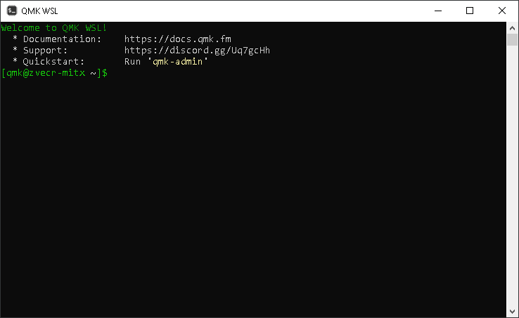

# QMK WSL

> A pre-configured WSL distro for working with the QMK CLI

Based on the exact same environment as QMK uses for CI, this installer package aims to give you a QMK build environment with as little effort as possible.

## Documentation

1. Install [WSL2](https://docs.microsoft.com/en-us/windows/wsl/install-win10)
1. Install the [latest release](https://github.com/qmk/qmk_distro_wsl/releases/latest)
1. Run [`qmk setup`](https://docs.qmk.fm/#/newbs_getting_started?id=set-up-qmk)
1. Run [`qmk compile`](https://docs.qmk.fm/#/newbs_getting_started?id=_4-test-your-build-environment)
1. Profit!

Full documentation is available at <https://wsl.qmk.fm/>.

## Official Website

[qmk.fm](https://qmk.fm) is the official website of QMK, where you can find links to this page, the documentation, and the keyboards supported by QMK.
