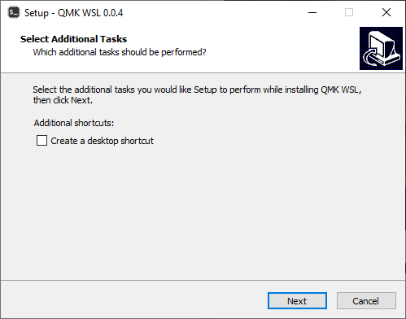
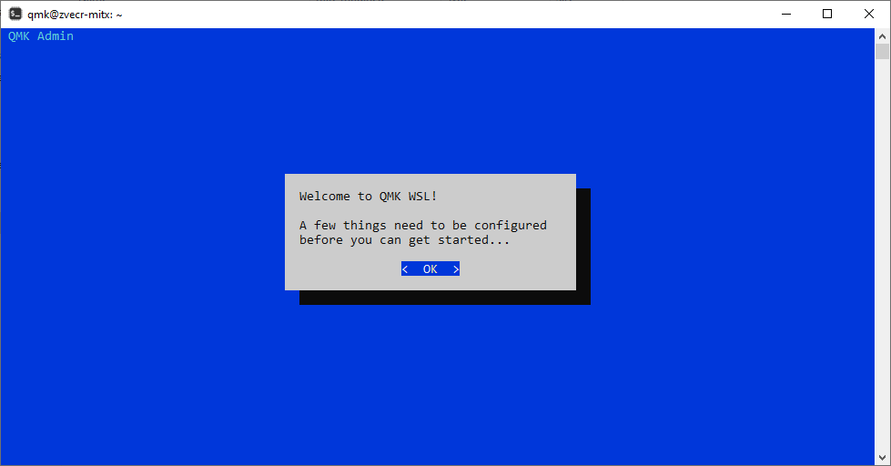
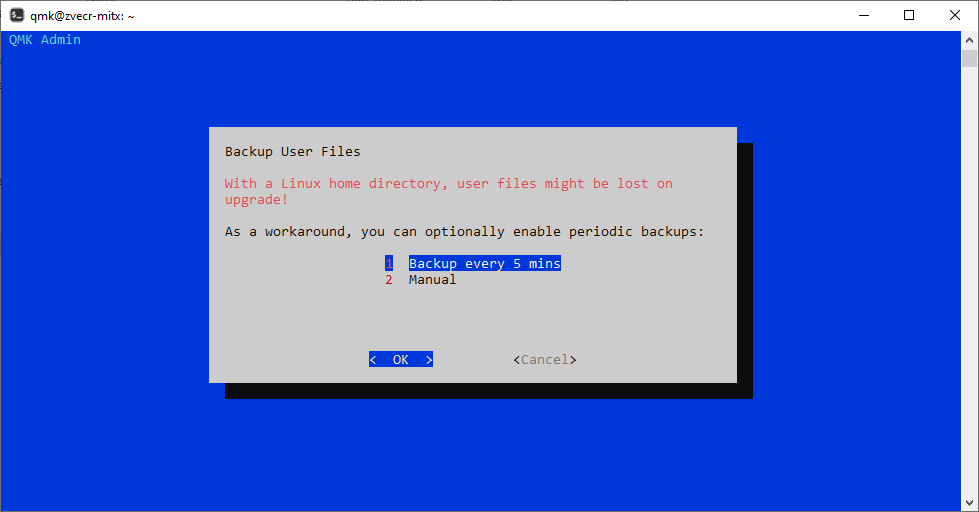

# Getting Started

1. Install [WSL2](https://docs.microsoft.com/en-us/windows/wsl/install-win10)  
1. Install the [latest release](https://github.com/qmk/qmk_distro_wsl/releases/latest)  

1. Open the `QMK WSL` shortcut  

1. Complete the first start wizard  

1. Run [`qmk setup`](https://docs.qmk.fm/#/newbs_getting_started?id=set-up-qmk)  

1. Run [`qmk compile`](https://docs.qmk.fm/#/newbs_getting_started?id=_4-test-your-build-environment)  

1. Profit!  

## Next Steps

The [QMK Tutorial](https://docs.qmk.fm/#/newbs_building_firmware) will walk you through creating a keymap for your keyboard.

#### Need help with something?
The best place to get quick support is going to be on our [Discord](https://discord.gg/Uq7gcHh). There is usually somebody online, and there are a bunch of very helpful people there.
